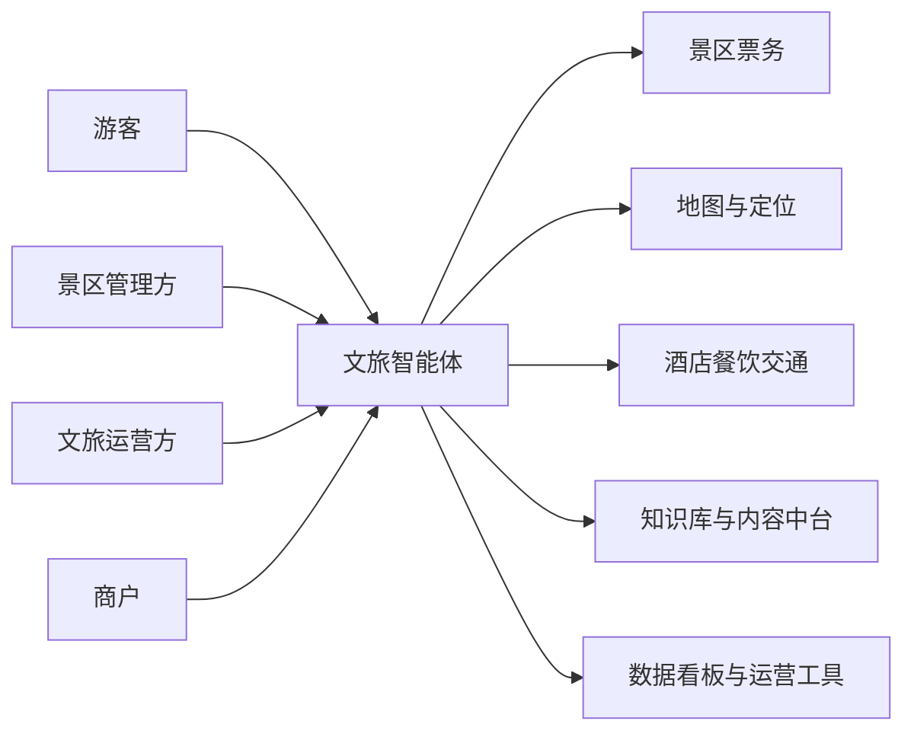
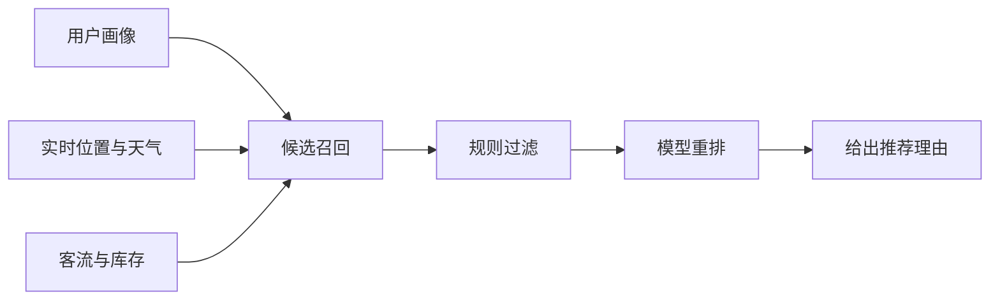
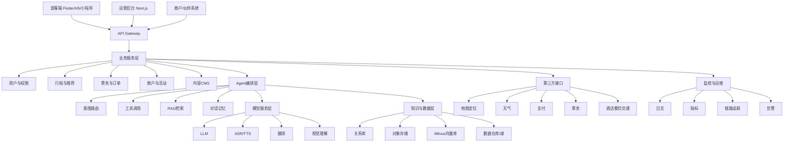
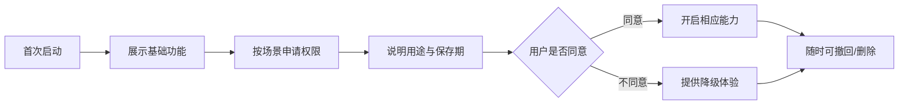

# 生活智能体文旅体软件需求说明书

## 执行摘要

本项目面向中等规模城市核心景区，建设覆盖游客、景区、运营方与商户的文旅智能体，以智能导览、动态行程、票务闭环和运营看板打通“搜、问、订、游、评、复购”链路，契合江汉区大赛“AI+垂直应用”对真实场景、可落地与可复制的要求，也符合国家智慧旅游行动计划对人工智能导览、沉浸体验和数据安全治理的方向。 citeturn22view0turn22view1turn22view2

## 项目定位与范围

文旅需求的恢复与升级，为“生活智能体—文旅体”提供了足够大的落地空间。文化和旅游部数据显示，2025年国内居民出游人次达到65.22亿、国内旅游花费达到6.30万亿元；中国旅游研究院同时判断，旅游经济已进入“繁荣发展新周期”，并呈现需求升级、市场下沉、时空分布更均衡等特征。与此同时，入境需求继续抬升，2024年海外民众对来华航班和住宿的搜索量平均较2023年同期高26%，这直接提升了多语言服务、跨文化解释和国际化交互的需求权重。 citeturn32search0turn12search5turn20search2

从竞赛对接角度看，江汉区AI智能体创新大赛明确设置“AI+技术创新”“AI+垂直应用”两大赛道，并强调场景落地；官方报道同时提到参赛团队可获得免费Token、现金奖励、算力、办公空间与“先投后股”等支持，这意味着评审重点不会停留在模型炫技，而会更关注“真实业务闭环、可复制部署、可运营结果”。国家《智慧旅游创新发展行动计划》也明确提出，鼓励城市和景区探索人工智能导览，加强智慧景区建设，并要求对旅游数据进行全生命周期安全管理。 citeturn22view0turn22view1

本需求说明书采用以下边界假设：试点场景为**中等规模城市核心景区**，覆盖“核心景区 + 周边博物馆/街区 + 商圈/餐饮 + 酒店/交通接驳”；首期目标是形成**景区级到城市级可扩展**的产品形态，而不是从第一天起做成全国OTA。产品重点不是“全网比价平台”，而是“城市文旅服务智能体 + 景区运营系统 + 商户协同接口”的垂直解决方案。

| 维度 | 定义 |
|---|---|
| 项目名称 | 生活智能体—文旅体 |
| 产品定位 | 面向游客的智能服务入口 + 面向B端/G端的运营协同平台 |
| 服务范围 | 问答、导览、规划、预约、联动消费、运营分析 |
| 首期试点 | 单一城市核心景区与周边消费带 |
| 上线形态 | 游客App/H5/小程序 + 运营后台 + 开放接口 |
| 竞赛对接 | AI+垂直应用；强调创新、实用、落地、可复制 |
| 赛制约束 | 提交物按用户给定条件为 `.ppt/.pptx`，单文件不超过50MB |

建议的业务目标采用“双层KPI”。**游客层**聚焦体验：行程生成成功率、导览满意度、推荐接受率、预约完成率。**运营层**聚焦效率：咨询转订单转化、联单渗透率、客流分流效果、热门时段拥堵缓解、人工客服分流率。**管理层**聚焦治理：异常预警提前量、投诉闭环时效、商户履约稳定度、内容安全合规率。

## 用户与场景设计

Booking.com 的全球调研显示，用户在AI旅行中的高频诉求已非常清晰：旅前主要使用AI研究目的地与最佳出行时机、寻找当地体验和餐厅；旅中则高度依赖翻译、在地活动建议、餐饮推荐以及陌生地点导航。同时，89%的受访者希望未来旅行规划中使用AI，但只有12%愿意让AI完全独立做决策，这说明文旅智能体的正确形态不是“替人拍板”，而是“可解释、可修改、可确认”的协同式智能体。 citeturn35view0

马蜂窝在“AI小蚂”相关案例中已经呈现出更细分的本地化人群差异：亲子家庭关注排队时长与婴儿车租赁，年轻用户关注网红咖啡厅与文化打卡，银发用户关注无障碍设施；这与入境需求回升、城市文旅标准化服务不足相叠加，说明本项目需要在用户画像上同时覆盖“高频本地周末游”和“首次到访外地/入境游客”两类人群。深圳市文旅智能体平台的官方表述也明确指向“用户—商户—政府”全场景，而不只是面向C端做一个聊天工具。 citeturn36view1turn20search2turn28view6

### 用户画像

| 用户角色 | 关键目标 | 主要痛点 | 典型价值主张 |
|---|---|---|---|
| 游客 | 快速得到适合自己的玩法 | 信息分散、路线不顺、排队与踩坑、语言障碍 | “少做攻略，多玩景点” |
| 景区管理方 | 降低现场拥堵与服务压力 | 客流高峰不可视、问询重复、评价处理慢 | “能看见、能预警、能干预” |
| 文旅运营方 | 拉动景区与周边消费联动 | 渠道割裂、活动投放粗放、转化难追踪 | “从流量到消费形成闭环” |
| 商户 | 获得更精准流量与订单 | 线上曝光低、库存更新慢、服务能力不可见 | “把正确客群带到正确门店” |

### 主要用户故事

| 角色 | 用户故事 |
|---|---|
| 游客 | 作为首次来访游客，我希望输入时间、预算、同行人和偏好后，30秒内得到可执行、可预约、可改动的行程。 |
| 游客 | 作为亲子游客，我希望系统自动避开高排队点位，并提示母婴室、婴儿车租赁、亲子餐厅与休息区。 |
| 游客 | 作为入境游客，我希望能用英文、日文或语音问路，得到多语言解释、菜单翻译和实时导航。 |
| 游客 | 作为演出/赛事观众，我希望买票后自动获得“交通+餐饮+住宿+夜游”的联动方案。 |
| 景区管理方 | 作为运营经理，我希望当核心点位拥堵超阈值时，系统自动推送替代路线并提醒限流。 |
| 景区管理方 | 作为客服主管，我希望高频问答由AI处理，投诉、退款、突发事件自动升级转人工。 |
| 文旅运营方 | 作为城市文旅运营者，我希望知道“哪类人被什么内容吸引、停留多久、转化在哪一步流失”。 |
| 商户 | 作为商户，我希望接入营业时段、优惠、库存与招牌商品，让智能体把匹配用户带到店。 |

### 角色关系示意

从设计原则上，本项目建议坚持三条：其一，**游客端以“任务完成”而非“聊天次数”作为核心目标**；其二，**B端工具必须与C端行为数据打通**，否则无法形成运营价值；其三，**默认“AI辅助决策”而非“AI替代决策”**，在关键动作前保留确认和原因解释。 citeturn35view0turn28view6

## 功能模块与交互流程

国内外头部产品已经提供了较清晰的功能路线图。Trip.com 把 TripGenie、行程生成、多语言语音/文本辅助、订单联动和智能提醒串为一体；飞猪在“飞猪千问”与 FlyAI 中强调机酒景全场景库存直连和可执行能力；马蜂窝把 AI 行程规划、菜单翻译、实时翻译、在地问答做成旅行助手；Booking.com 和 Expedia 则把 AI 规划、语音支持、行中变更与超个性化连接起来。Google Maps 近年的 “Ask Maps” 与沉浸式导航也说明，地图化交互和3D可视化正在成为行中阶段的重要入口。 citeturn30view0turn31view0turn28view0turn36view0turn22view6turn22view7turn22view8

### 功能优先级总表

| 模块 | 业务目的 | MVP | 次要 | 未来 |
|---|---|---|---|---|
| 智能导览 | 到点即用、在地讲解、分流避堵 | POI问答、地图路线、拥堵提醒 | 无障碍路线、室内导览 | UWB/蓝牙高精定位 |
| 行程规划 | 旅前决策与可执行计划 | 1-3日行程、预算、营业时段约束 | 协同编辑、多人偏好融合 | 多城市/长线串联 |
| 语音/多模态交互 | 降低操作门槛 | 文本/语音问答、图片识别问答 | 菜单翻译、实时字幕 | 实时同传、可穿戴交互 |
| 个性化推荐 | 提升点击与消费转化 | 内容推荐、理由解释、重排序 | 券包推荐、活动推荐 | 跨周期会员运营 |
| 票务与预约 | 形成交易闭环 | 门票/时段预约、订单状态 | 套票、退改签规则 | 动态定价与会员权益 |
| 商旅联动 | 提高客单与联单 | 酒店/餐饮/交通联动 | 会展/演出/赛事套餐 | 企业差旅规则集成 |
| AR/VR沉浸体验 | 提升体验与传播 | 轻量AR打卡、VR预览页 | 交互剧情、数字人导览 | 数字孪生/多人联机 |
| 数据看板与运营工具 | 运营与治理闭环 | 客流、咨询、转化看板 | 预测预警、AB实验平台 | 资源调度与数字孪生 |
| 第三方接口与开放平台 | 生态协同与扩展 | 地图/天气/支付/票务接口 | 酒店/CRM/会员接口 | Partner SDK/插件市场 |

### 智能导览

**功能清单**：景点知识问答、LBS到点讲解、推荐游线、热度/排队避让、厕所/母婴室/无障碍设施搜索、收藏与分享。  
**优先级**：MVP 做 POI问答、地图路线、拥堵提醒；次要做无障碍线路和主题导览；未来再叠加室内高精定位与数字导游。  
**关键交互**：游客要么通过扫码进入，要么通过定位进入。系统先判断位置、语言和人群标签，再给出“最短路”“轻松走”“亲子游”“文化深读”等路线模板。

### 行程规划

**功能清单**：输入天数、预算、同行人、主题偏好；结合天气、营业时间、交通时长、票务库存与演出活动，生成可执行日程；支持拖拽修改、收藏、导出和一键预订。  
**优先级**：MVP 聚焦 1—3 日本地/短途行程；次要支持多人协同编辑；未来支持跨城与跨交通方式联动。  
**关键交互**：系统不应只“写一段攻略”，而要输出**可订、可走、可解释**的日程卡。

### 语音与多模态交互

**功能清单**：文本/语音咨询、图片识别问答、菜单/路牌翻译、景区海报解释、结果语音播报。  
**优先级**：MVP 先做文本+语音+单图问答；次要做菜单翻译与实时字幕；未来做实时同传和连续对话记忆。  
**关键交互**：建议把“说、拍、问”做成统一入口，不再强制用户在“文字搜索—地图—翻译”之间来回切换。马蜂窝与Booking.com的研究都表明，翻译、在地推荐、导航是旅中AI高频能力。 citeturn36view0turn36view1turn35view0

### 个性化推荐

**功能清单**：按用户画像、实时位置、天气、客流、历史行为与商户侧库存进行召回和重排；给出推荐原因；支持“少排队”“适合带娃”“适合夜游”等策略标签。  
**优先级**：MVP 做内容和POI推荐；次要再做券包、套餐与活动推荐；未来连接会员分层和复购触达。  
**关键交互**：推荐页必须展示“为什么推荐你”，否则用户难以建立信任。

### 票务与预约

**功能清单**：门票查询、库存实时查询、时间段预约、订单确认、电子凭证、到场核销、退款/改签规则展示。  
**优先级**：MVP 必须形成景区门票与预约闭环；次要可扩展为多产品联票、套票；未来再做价格实验与会员权益。  
**关键交互**：任何“推荐”如果不能顺畅落到“预约/购买”，都很难体现垂直应用价值。

### 商旅联动

**功能清单**：演出/赛事/景区门票与酒店、餐饮、接驳、夜游、伴手礼联单推荐；支持商务住宿、报销凭证、会议周边玩法。  
**优先级**：MVP 可以先做“景区/演出 + 餐饮/酒店/交通”轻联单；次要做会展/商务情境；未来做企业差旅规则与政企活动接入。  
**关键交互**：深圳文旅智能体平台强调“观演、观赛+X”立体行程，这一思路适合同城文旅体消费联动。 citeturn28view6

### AR 与 VR 沉浸体验

**功能清单**：景点AR叠加讲解、历史场景复原、VR预览页、数字人引导、拍照打卡分享。  
**优先级**：MVP 建议做轻量级内容：H5/小程序全景页、限定点位AR；次要再上更重的剧情互动；未来扩到数字孪生与多人联机。  
**关键交互**：国家层面已将“智慧旅游沉浸式体验新空间”列为试点方向，且明确鼓励AR、VR、AI等新技术提高互动感。因而本模块不宜只做装饰，应该服务于“到访前预览、到访中讲解、到访后传播”三段链路。 citeturn8search0turn22view2turn8search4

### 数据看板与运营工具

**功能清单**：客流热力、咨询热点、推荐点击、转化漏斗、订单履约、活动效果、商户表现、投诉与舆情预警；后台支持内容CMS、标签管理、运营策略配置。  
**优先级**：MVP 先做客流/咨询/转化三类看板与内容配置；次要做人流预测和活动归因；未来做调度建议与资源优化。  
**关键交互**：此模块决定项目是否只是“游客工具”，还是“可运营的数字基础设施”。

### 第三方接口与开放平台

**功能清单**：地图、天气、支付、门票、酒店、餐饮、交通、会员、CRM、短信、推送、开放API/SDK、Webhook。  
**优先级**：MVP 只接入最关键能力：地图、天气、支付、官方票务；次要对接酒店/餐饮/会员；未来扩展为合作伙伴插件市场。  
**关键交互**：飞猪 FlyAI 已把“机、酒、景等全场景AI能力 + 官方商品库实时库存 + OpenClaw协议”打造成原生 Agent 接口形态，这说明文旅Agent要想真正完成任务，必须具备“工具调用 + 库存直连 + 鉴权与配额”能力。 citeturn28view0turn23view1

## 非功能指标与技术架构

### 非功能需求目标

以下指标按“中等规模城市核心景区试点”设定，为产品设计目标，并建议在首发版本就纳入验收。

| 类别 | 目标值 |
|---|---|
| 页面性能 | 首屏加载 p95 ≤ 2.5 秒；关键查询 p95 ≤ 800 ms |
| 智能对话 | 普通问答首Token ≤ 2 秒；复杂RAG问答 ≤ 4 秒；行程生成 ≤ 20 秒 |
| 并发能力 | 峰值同时在线 5,000；API 网关 300 QPS；AI推理 80 QPS 可水平扩展 |
| 可用性 | 游客侧月可用性 ≥ 99.9%；预约/票务核心链路 ≥ 99.95% |
| 安全性 | 全链路 HTTPS；敏感字段加密；RBAC；审计日志；异常登录告警 |
| 隐私保护 | 最小化采集、分权授权、可撤回、可导出、可删除 |
| 离线能力 | 最近行程、核心POI包、讲解音频、本地地图缓存可离线可用 |
| 跨平台 | iOS、Android、H5/小程序、运营Web后台 |
| 国际化 | 首期支持简中/英文；次期扩展日语、韩语；支持时区、货币、单位切换 |
| 可观测性 | 延迟、错误率、Token消耗、ASR时长、RTC时长、转化漏斗可监控 |

### 总体技术架构

Flutter 适合承担游客端跨平台应用，因为其官方明确支持从单代码库部署到 mobile、web、desktop；Kubernetes 适合承载后端与AI服务，因为其官方强调扩缩容、故障转移和金丝雀/受控部署能力；Milvus 适合作为向量检索层，因为其官方定位就是大规模相似性检索；WebRTC 适合实时音视频和低延迟语音链路。 citeturn26view0turn26view1turn26view11turn26view3

### 关键技术选型建议

| 技术域 | 优先方案 | 备选方案 | 选择理由 |
|---|---|---|---|
| 游客端 | Flutter | uni-app / Taro | 一套代码覆盖 iOS/Android/Web，适合比赛期快速迭代与后续原生深化 |
| 运营后台 | Next.js | Vue 3 + Vite | SSR/组件生态成熟，适合仪表盘和内容运营台 |
| 业务后端 | Java Spring Boot | NestJS | 适合订单、权限、事务与复杂集成 |
| AI 网关 | Python FastAPI | Go | 方便接 LLM、ASR、TTS、RAG 与推理链编排 |
| Agent 编排 | LangGraph | Dify / LlamaIndex Workflows | 对工具调用、状态机、多步任务更友好 |
| 模型接入 | 阿里云百炼为主 | DeepSeek API / 腾讯混元 | 中文、多模态、翻译、语音与中国内地部署条件较友好，DeepSeek 适合作为成本敏感备份 |
| ASR | Paraformer / FunASR | 腾讯实时语音识别 | 中文实时识别成熟，可按语音场景拆分 |
| TTS | CosyVoice | 供应商TTS或本地模型 | 支持实时合成与多音色 |
| 机器翻译 | Qwen-MT | 通用LLM翻译 | 支持多语种互译与术语干预，更适合景区术语与菜单场景 |
| 向量检索 | Milvus | pgvector / Elasticsearch Hybrid | 扩展性高，适合多模态知识库 |
| 实时通信 | WebRTC | WebSocket/SSE | 语音/视频优先 WebRTC；文本流可用 SSE |
| 容器化 | Docker + Kubernetes | PaaS 托管 | 可扩缩容、便于灰度与多环境管理 |
| CI/CD | GitHub Actions / GitLab CI + Argo CD | Jenkins | 自动化测试、构建、灰度与回滚链路清晰 |
| 可观测性 | Prometheus + Grafana + Loki + OpenTelemetry | 云厂商可观测套件 | 能同时监控系统、模型与业务指标 |

在模型侧，阿里云百炼官方文档显示其可提供文本、图像、音频、视频等多模态模型；Qwen-MT 支持 92 个语种互译；中国内地部署模式下，Qwen-MT-Flash 的输入/输出价格为每百万Token 0.101/0.280 美元，`qwen-doc-turbo` 为每百万Token 0.087/0.144 美元。DeepSeek 官方则提供 OpenAI/Anthropic 兼容格式，`deepseek-v4-flash` 具备 1M 上下文、Tool Calls 能力，价格为输入缓存命中 0.02 元、未命中 1 元、输出 2 元/百万Token。这种组合很适合本项目采用“主供应商一体化 + 备用模型降本/容灾”的双栈策略。 citeturn26view10turn28view2turn25view0turn22view9turn24view0

在语音和实时层，阿里云已提供实时语音识别和实时音视频能力；其 RTC 文档显示纯音频通话价格为 0.006 元/分钟，720P 以下视频为 0.024 元/分钟；WebRTC 与实时音频接口则适合浏览器和移动端的低时延交互。对于比赛阶段，建议优先做“文本/语音问答 + 点击播报”的轻实时方案，把持续双向语音座席放到次阶段。 citeturn27search6turn33view0turn26view3turn26view4turn26view5

在知识库与检索层，Milvus 版采用 CU + 存储计费，北京地区按量可从 0.33 元/CU/时起，存储为 0.00025 元/GB/时。这意味着首期只要控制索引规模、把高频知识做结构化和缓存，成本是可控的。建议采用“结构化数据库 + 向量库 + 缓存”三层知识架构：高频规则和POI字段走关系库，非结构化讲解内容走对象存储，语义检索走 Milvus。 citeturn23view4turn26view11

### 人力、周期与预算估算

以下为**不精确估算**，用于项目申报与资源排期，不作为采购报价。

| 方案档位 | 团队规模 | 周期 | 人月 | 预算范围 | 适合场景 |
|---|---:|---:|---:|---:|---|
| 精简 | 5–6人 | 10–12周 | 16–22人月 | 35–60万元 | 以比赛MVP和示范Demo为主 |
| 标准 | 8–10人 | 4–5个月 | 35–50人月 | 80–150万元 | 可做景区试点与小范围商户接入 |
| 充足 | 12–15人 | 6–8个月 | 70–100人月 | 180–350万元 | 可做城市级联动、AR内容与稳定运维 |

**建议团队配置**：产品经理、UI/UX、Flutter工程师、Web前端、后端工程师、AI/算法工程师、测试工程师、数据/运营工程师；标准与充足方案再补充一名 DevOps 与一名内容策展/标注负责人。

**月度云成本经验区间**可分为：精简 1–3 万元、标准 3–8 万元、充足 8–20 万元。其主要变量不是服务器本身，而是 Token 消耗、ASR/TTS 秒数、RTC 通话时长、视频/AR 资产分发与向量检索用量。以上变量均可按供应商官方计费项拆解核算。 citeturn24view0turn25view0turn23view4turn33view0

## 数据合规测试与运维

### 数据需求与标注策略

国家政策已经把智慧旅游的数据安全、分级分类、全生命周期管理写入行动计划；个人信息保护法与数据安全法则分别为个人信息处理与一般数据处理提供了法律底线。对公众提供生成式AI服务时，还需要同时考虑生成式人工智能服务管理要求、备案信息公示要求以及生成内容标识要求。 citeturn22view1turn26view6turn26view7turn26view8turn39search0turn39search4turn39search5

| 数据类型 | 典型内容 | 用途 | 处理建议 |
|---|---|---|---|
| 结构化业务数据 | POI、营业时间、门票库存、商户库存、活动日历 | 查询、预约、联单 | 关系库保存，强校验与版本控制 |
| 半结构化内容数据 | 景点介绍、导览词、FAQ、攻略、评论摘要 | RAG 知识生成 | 文档分块、来源溯源、定期更新 |
| 多模态数据 | 图片、菜单、路牌、语音、AR资源 | 图片问答、翻译、讲解、沉浸体验 | 对象存储 + 元数据标签 |
| 用户行为数据 | 点击、收藏、停留时长、路线偏好 | 推荐、运营分析、AB实验 | 脱敏埋点、聚合分析为主 |
| 身份与账号数据 | 手机号、登录ID、会员信息 | 登录、订单、通知 | 与行为数据逻辑隔离，字段级加密 |
| 敏感数据 | 精准位置、行踪轨迹、未成年人信息、支付相关信息 | 导航、风控、交易 | 单独授权、缩短留存、最少可用 |
| 运营数据 | 人流热度、投诉、告警、工单 | 管理与治理 | 明确角色权限与审计链路 |

**标注需求**建议按三层建设。  
第一层是**基础标签**：景点类别、客群适配、可达性、设施、季节性、时长、预算等级。  
第二层是**场景标签**：亲子、银发、Citywalk、演出前后、下雨天、夜游、半日游等。  
第三层是**模型评测集**：问答集、路线合理性对照集、翻译正确性集、票务工具调用集、安全拒答集。  
其中，马蜂窝公开案例反映出的“亲子看排队、年轻人看打卡、银发看无障碍”差异，值得直接转化为标注体系与推荐规则。 citeturn36view1

### 授权流程与隐私策略

个人信息保护法将“行踪轨迹”等列入敏感个人信息范畴，并要求处理敏感个人信息需具备特定目的、充分必要性并取得单独同意；同时，法律明确反对过度收集和“一揽子授权”。因此，本项目不应在首次启动时一次性索取全部权限，而应采用“按场景、分步骤、可撤回”的授权模式。 citeturn38search0turn38search4

建议的具体策略如下：

| 场景 | 权限 | 策略 |
|---|---|---|
| 智能导览 | 定位 | 首次进入地图/导览页时申请；拒绝后提供手动选点 |
| 语音问答 | 麦克风 | 首次点击语音按钮时申请；默认不后台录音 |
| 图片识别/菜单翻译 | 相机/相册 | 首次使用拍照问答时申请；默认不自动上传原图 |
| 亲子服务 | 儿童信息 | 非必填；若涉及未成年人数据，单独监护人同意 |
| 订单通知 | 手机号/推送 | 与交易场景绑定；允许仅站内通知 |
| AR/VR | 陀螺仪/相机 | 进入沉浸模块时单独申请；允许浏览模式跳过 |

**存储策略**建议采用四段式：  
其一，PII 与行为日志物理或逻辑分库；  
其二，手机号、证件号、订单标识做字段级加密；  
其三，原始语音和图片仅在需要训练/申诉留痕的场景短期留存，默认优先本地处理与抽取特征；  
其四，知识库文档保留来源、时间戳、运营责任人，支持一键下线和版本回滚。  
若未来提供对公众开放的生成式内容服务，应在显著位置公示所使用的已备案生成式服务信息，并对生成的图片、音频、视频、虚拟场景等内容按规定添加显式或隐式标识。 citeturn39search4turn39search5

### 测试与验证方案

RAG 评估不能只看“回答像不像”，还要看召回是否准、回答是否基于依据、排序是否合理。RAGAS 论文明确提出可对检索与生成不同维度做参考答案稀缺条件下的系统化评估；`ndcg_score` 是标准排序质量指标；BERTScore 则适合评估文本生成与人工参考答案的语义相似度。 citeturn34view0turn34view1turn34view2

| 测试类别 | 核心对象 | 指标建议 | 目标值 |
|---|---|---|---|
| 功能测试 | 核心用户故事 | 通过率、缺陷等级、关键路径成功率 | 关键路径通过率 ≥ 95% |
| 性能测试 | 搜索/问答/行程/预约 | p95 延迟、错误率、峰值并发、资源占用 | 关键链路 p95 达标，错误率 < 1% |
| 推荐测试 | 推荐与排序 | CTR、收藏率、转化率、NDCG@10 | NDCG@10 ≥ 0.78 |
| RAG 测试 | 景点问答、规则问答 | grounded answer rate、hallucination rate、RAGAS | 有依据回答率 ≥ 90%，幻觉率 ≤ 5% |
| 翻译测试 | 菜单/路牌/导览词 | 人工 adequacy / fluency、误译率 | 关键术语误译率 ≤ 3% |
| ASR/TTS 测试 | 语音交互 | 识别错误率、播报中断率、主观MOS | 可理解率 ≥ 95% |
| A/B 测试 | 推荐样式、解释文案、入口布局 | 转化 uplift、停留时长、满意度 | 以业务 uplift 为准 |
| 安全测试 | 越权、注入、内容违规 | 风险工单数、拦截准确率 | 高危缺陷清零 |

**实验设计建议**：  
将“解释型推荐卡片”与“无解释推荐卡片”做随机实验；将“地图优先入口”和“聊天优先入口”做分组实验；将“默认机械回答”与“带来源依据回答”做信任实验。之所以要把“解释”和“人工兜底”作为实验要素，是因为 Booking.com 调研显示：绝大多数用户愿意在未来旅行中使用 AI，但多数用户依然会核验结果，也不愿把最终决策完全交出去。 citeturn35view0

### 部署与运维计划

Kubernetes 官方文档明确指出其适合做扩缩容、故障转移与 canary deployment，因此推荐采用**蓝绿 + 金丝雀**的上线模式；模型网关要与业务网关分开发布，以避免大模型侧抖动影响预约和订单主链路。 citeturn26view1

| 维度 | 建议 |
|---|---|
| 上线节奏 | 先内测、再景区闭环试点、再城市联动扩展 |
| 发布策略 | 开发/预发/生产三环境；生产采用蓝绿 + 金丝雀 |
| 回滚策略 | 核心功能保留上一稳定版本镜像；模型Prompt 与知识包可秒级回退 |
| SLA | 游客侧 99.9%；票务/订单主链路 99.95% |
| 监控指标 | DAU、活跃会话、首Token时延、导览触发率、预约成功率、客诉率、商户履约率 |
| 告警机制 | CPU/内存、错误率、Token异常、接口超时、库存同步失败、内容风险 |
| 运维值守 | 旺季/节假日 7×24 on-call；平峰日工作时段值守 |
| 应急预案 | 地图失效、票务接口故障、模型不可用、景区突发封控、热点舆情五类预案 |

### 风险评估与缓解措施

| 风险类型 | 具体风险 | 缓解措施 |
|---|---|---|
| 技术 | 模型幻觉导致讲解错误或路线不合理 | 所有关键问答走 RAG + 来源展示；路线类任务引入规则校验器 |
| 技术 | 高峰期延迟上升，影响体验 | 热门问答缓存、票务与问答链路隔离、异步生成长任务 |
| 技术 | 外部接口波动 | 适配层隔离、熔断重试、降级到本地静态策略 |
| 合规 | 过度授权、位置与儿童信息处理不当 | 按场景授权、最小化采集、监护人同意、短期留存 |
| 合规 | 面向公众的生成式服务未完成备案/公示/标识 | 立项即做备案评估清单；上线前完成法务与网信检查 |
| 商业 | 商户接入不足，联单价值不明显 | 首期只引入头部商户和官方票务，保证履约质量 |
| 商业 | 用户把产品当作通用聊天工具，转化低 | 入口以“导览、行程、预约”任务页为主，不以泛聊天为主 |
| 伦理 | 推荐过度商业化、伤害用户体验 | 推荐理由透明、广告位显著标识、保留“只看中立推荐”选项 |
| 伦理 | 文化解释失真、历史内容不准确 | 文化内容采用专家审校与来源白名单 |
| 伦理 | 老年/障碍用户被排除 | 大字模式、语音播报、无障碍路线、人工客服兜底 |

## 竞品参考与实施计划

### 竞品比较

| 产品 | 功能特征 | 落地场景 | 优势 | 局限 | 对本项目启示 |
|---|---|---|---|---|---|
| Trip.com TripGenie / Trip.Planner | 多语言问答、行程生成、路线概览、订单联动、旅中提醒 | OTA与国际化出行 | 规划—订单—行中提醒闭环强，国际化成熟 | 更偏平台级出行，不专注单一景区深运营 | 文旅智能体必须把“规划—预订—到访”打通，而非只做攻略。 citeturn30view0turn28view5 |
| 飞猪千问 / FlyAI | AI旅行助手、机酒景全场景搜索、官方库存直连、Agent接口 | OTA、开发者开放平台 | 商品和库存可执行性强，开放能力明确 | 更偏交易生态，需要外部景区有较好供给标准化 | 开放平台要支持工具调用和实时库存，才能真正形成“能说也能做”的智能体。 citeturn31view0turn28view0 |
| 马蜂窝 AI小蚂 / AI路书 | 行程规划、酒店AI砍价、餐厅预订、菜单翻译、实时翻译、在地问答 | 自由行、亲子、出境游 | 旅中高频问题抓得准，翻译与在地场景体验强 | 对景区管理与城市治理侧支持较弱 | 本项目应把“旅前规划 + 旅中翻译/导航 + 旅后复购”做成连续体验。 citeturn36view0turn22view4turn36view1 |
| 深圳市文旅智能体平台 | 用户、商户、政府全场景；观演/观赛+X；数据中台协同 | 城市级文旅体消费平台 | 生态整合与治理侧站位高 | 平台重、建设周期更长 | 本项目宜从景区级MVP起步，但架构上预留城市级扩展。 citeturn28view6 |
| Booking.com AI Trip Planner / AI Voice Support | AI行程规划、住宿问答、评论摘要、语音支持 | 国际旅行平台 | 规划与语音入口清晰，用户研究方法成熟 | 以住宿和平台交易为主，在地运营深度有限 | 要重视“AI辅助而非完全自治”的信任设计。 citeturn22view6turn29search1turn35view0 |
| Expedia Romie | 超个性化、群聊规划、计划变更、行中协助 | 出行平台与群体旅行 | 群体决策与异常变更处理思路先进 | 国内本地生活链接相对弱 | 适合借鉴到“多人同行偏好融合”和“天气/突发变化自动调度”。 citeturn22view7turn15search3 |

补充参考上，Google Maps 的 “Ask Maps” 与沉浸式导航说明：地图界面、语音引导、3D可视化和停车/步行前后链路，是行中导航体验的重要增量方向，适合被借鉴到景区级 AR 导览和城市微交通引导中。 citeturn22view8turn13search5

### MVP 范围与交付物

建议将 MVP 定义为：**智能导览、行程规划、语音/多模态问答、个性化推荐、票务预约闭环、基础运营看板、开放接口底座**。  
AR/VR、商旅联动与高级预测/运维能力视资源作为**“比赛增强项”**，做到可演示、可扩展即可，不建议在比赛冲刺期硬做全量工业化。

| 交付物 | 说明 |
|---|---|
| 软件需求说明书 | 本文档，供研发、演示与评审统一理解 |
| 产品原型 | 游客端主流程 + 运营后台主流程 |
| 交互说明 | 关键页面状态、异常场景、权限流程 |
| 数据字典 | POI、商户、活动、订单、日志、标签表 |
| API清单 | 内部服务与第三方对接清单 |
| 架构图 | 系统架构、数据流、部署图、权限流 |
| Demo脚本 | 讲解词、场景切换、演示数据 |
| 测试报告 | 功能、性能、模型效果、合规清单 |
| 参赛PPT | 适配 `.ppt/.pptx`、50MB 内 |
| 演示视频 | 10–30 秒精简版，供答辩与线上展示 |

### 开发里程碑

| 阶段 | 周期 | 关键输出 |
|---|---|---|
| 需求澄清 | 第1–2周 | 业务边界、赛题映射、故事清单、指标草案 |
| 原型设计 | 第3–4周 | 信息架构、线框图、交互稿、技术方案定版 |
| 数据准备 | 第3–5周 | 景区POI库、FAQ库、标签体系、评测集 |
| 核心开发 | 第5–8周 | 导览、规划、问答、推荐、预约主链路 |
| 增强开发 | 第9–10周 | 运营看板、开放接口、商旅轻联单、AR轻演示 |
| 联调测试 | 第11–12周 | 性能压测、灰度发布、模型评测、修复缺陷 |
| 比赛封板 | 第13–14周 | PPT、Demo视频、答辩脚本、试点数据口径 |

### 优先参考来源

| 来源层级 | 作用 | 推荐来源 |
|---|---|---|
| 国家与地方官方 | 赛题对接、政策依据、合规底线 | 武汉市科技局、文化和旅游部、中央网信办 |
| 行业官方数据 | 市场规模与趋势判断 | 文化和旅游部统计、公报，中国旅游研究院 |
| 官方产品来源 | 竞品能力与功能证明 | Trip.com、飞猪、Booking.com、Expedia 官方新闻/文档 |
| 原始技术文档 | 技术选型与成本核算 | Flutter、Kubernetes、Milvus、阿里云百炼、DeepSeek、WebRTC |
| 原始论文 | 模型评估方法 | RAGAS、BERTScore、IR 排序指标文档 |

## 参赛PPT转化建议

按赛制约束，PPT更适合讲清三件事：**为什么必须做、为什么你能做成、为什么这不是空想**。建议整体控制在 **14–16 页**，其中“故事页”占三分之一，“架构与可行性页”占三分之一，“计划与价值页”占三分之一。所有页面都要避免大段解释性文字，尽量把“功能、架构、指标、节奏”变成图、表、流程。竞赛官方已明确强调垂直应用与落地价值，因此 PPT 不应过度铺陈大模型原理，而应突出业务闭环与试点可复制性。 citeturn22view0turn22view1

### 可直接转为 PPT 的页面结构与要点

下表中的“页内文案”按照**每页不超过8行、每行不超过12字**控制，可直接粘入幻灯片作为文案骨架。

| 幻灯片标题 | 页内文案示例 |
|---|---|
| 封面 | 生活智能体 文旅体方案 AI+垂直应用 中等城市试点 团队名称 日期 |
| 赛题与机会 | 旅游需求高增 政策明确支持 服务链路割裂 现场决策低效 运营数据孤岛 智能体可补位 |
| 项目定位 | 面向游客端 覆盖管理端 连接商户端 任务优于聊天 先景区后城市 先闭环后扩张 |
| 目标用户 | 首次来访客 亲子家庭客 入境多语客 银发休闲客 景区管理方 文旅运营方 |
| 场景故事 | 问哪里好玩 看怎么走顺 订什么时段 到场怎么游 走后怎么复购 后台怎么优化 |
| 总体方案 | 一体化入口 多模态交互 规划导览预约 商旅消费联动 运营数据闭环 开放接口扩展 |
| 功能矩阵 | 智能导览 行程规划 语音多模态 个性化推荐 票务与预约 运营与开放 |
| 智能导览页 | 到点即讲解 地图即路径 拥堵可避让 主题可切换 亲子银发适配 来源可追溯 |
| 规划推荐页 | 输入偏好预算 约束自动求解 计划可改可订 推荐给出理由 天气客流联动 联单同步生成 |
| 票务联动页 | 官方库存直连 预约支付闭环 商圈酒店联动 演出赛事加成 订单状态同步 凭证一键核销 |
| 运营看板页 | 客流热力图 咨询热点图 转化漏斗图 商户表现图 告警工单流 活动归因图 |
| 技术架构页 | 前端跨平台 后端微服务 Agent编排层 知识库检索层 模型服务层 监控运维层 |
| 安全合规页 | 分级授权 最小采集 敏感单独同意 内容显著标识 日志全程审计 备案清单前置 |
| 开发计划页 | 两周定需求 两周出原型 四周做核心 两周做增强 两周联调测 两周封板参赛 |
| 成本与团队页 | 三档资源包 精简可参赛 标准可试点 充足可扩城 人月清晰可算 云费可按量控 |
| 收尾价值页 | 游客更省心 景区更高效 运营更可视 商户更精准 城市可复制 项目可投放 |

### 视觉与字数建议

| 维度 | 建议 |
|---|---|
| 画幅 | 16:9 宽屏 |
| 主色 | 科技蓝 + 文旅暖色点缀 |
| 字号 | 标题 28–36；正文 18–24 |
| 页面结构 | 一页只讲一个结论 |
| 图表比例 | 图表/流程 > 文字 |
| 文字控制 | 单页最好 60 字以内核心文案 |
| 图形风格 | 统一圆角卡片、统一图标、统一箭头 |
| 演示逻辑 | 痛点 → 场景 → 方案 → 架构 → 落地 → 价值 |

### 在 50MB 内呈现多媒体演示

| 资产类型 | 建议做法 | 大小预算 |
|---|---|---:|
| 封面图 | JPG 压缩，最长边 1600px | 1–2MB |
| UI 截图 | PNG 或高压缩 JPG | 6–10MB |
| 架构图/流程图 | 优先 SVG/EMF 或矢量导出 | <2MB |
| 短视频 | 720p、H.264、8–12 秒/段 | 2–4MB/段 |
| 视频总量 | 控制在 2 段以内 | ≤8MB |
| 动画 | 用页面切换替代复杂动画 | 接近 0MB |
| 字体 | 尽量用系统字体，避免全量嵌入 | 0–2MB |
| 整体控制 | 预留 10MB 机动空间 | ≤40MB 较稳妥 |

**做法建议**：不要在 PPT 内嵌长 GIF，优先嵌入短 MP4；不要放“完整产品录像”，而要放“关键闭环 10 秒演示”：如“输入偏好 → 生成行程 → 一键预约”“到点语音问答 → 地图改线 → 票务提醒”。这样既能保证文件大小，又能显著提高评审理解速度。

### Mermaid 页面建议

下列三类图最适合直接放进PPT：

- **用户关系图**：帮助评审一眼看懂这不是单纯游客助手，而是“游客—景区—运营—商户”的协同平台。  
- **关键业务流**：至少放“规划到预约闭环图”和“运营数据回流图”。  
- **技术架构图**：尽量分层，不要堆满技术名词；每层只放 3–5 个关键模块。  

如果时间紧，优先把 Mermaid 图导出为 SVG 后放进 PPT，以减少排版风险；若现场环境不稳定，则直接转成静态图片，避免字体兼容问题。

## 结论

对于“生活智能体—文旅体”赛题，最有竞争力的方案不是做一个“会聊天的景区App”，而是做一个能把**游客任务完成、景区现场调度、运营增长分析、商户供给协同**放到同一条数据链上的垂直智能体系统。国家政策已经明确支持 AI 导览、智慧景区、沉浸式新空间与数据安全治理；头部产品已证明用户愿意在旅前与旅中广泛接受 AI 辅助，但也同时要求透明、可信、可控。因此，本方案在产品上采取“辅助式智能体”，在架构上采取“可扩展双栈”，在实施上采取“景区级MVP → 城市级扩展”的路径，更适合比赛场景下的快速交付与后续真实落地。 citeturn22view1turn22view2turn35view0turn28view6